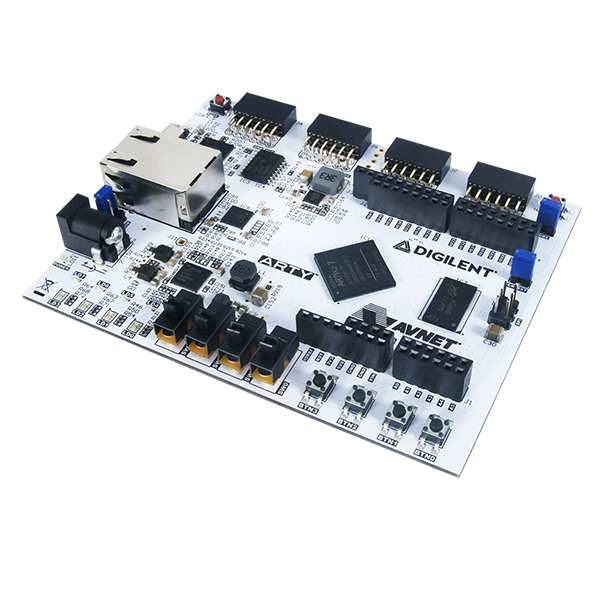

# SPUD RISC-V SoC

A complete RISC-V System-on-Chip with RV32IM core, instruction cache, and peripheral subsystem. Designed for the Digilent Artix-7 Arty FPGA and includes a Verilator-based testbench for simulation.

**Based on:** [ultraembedded/riscv_soc](http://github.com/ultraembedded/riscv_soc)

## What's Included

- **RISC-V Core** (`core/`) - RV32IM CPU with 16KB instruction cache
- **SoC Peripherals** (`soc/`) - UART, Timer, GPIO, SPI, IRQ controller
- **FPGA Project** (`fpga/arty/`) - Complete Vivado project for Arty board
- **Testbench** (`tb/`) - Verilator/SystemC testbench for simulation
- **Bitstream** (`spud.bit`) - Pre-built FPGA bitstream
- **Python Tools** (`fpga/arty/run/`) - Scripts for loading and running programs

## Hardware Features

**CPU Core**
- RISC-V RV32IM (32-bit with integer multiply/divide)
- 16KB instruction cache (8KB × 2-way associative)
- Configurable reset vector
- Machine mode only

**Peripherals**
- **UART** - Serial communication (configurable baud rate, default 1Mbaud)
- **Timer** - Two 32-bit timers with compare and interrupt
- **GPIO** - 32-bit GPIO with interrupt support (level/edge triggered)
- **SPI** - SPI master interface with FIFO
- **IRQ Controller** - 4 interrupt sources with priority and masking

**Memory Interface**
- AXI4 master port for main memory (DDR3 on Arty board)
- AXI4-Lite slave port for debug bridge access
- 256MB address space for main memory (0x80000000 - 0x8fffffff)

**Debug Features**
- UART-based debug bridge for loading programs and memory access
- Python scripts for easy program upload and execution
- Memory read/write tools (peek/poke)

## Using the Testbench

The SoC includes a Verilator/SystemC testbench for simulation without hardware.

### Prerequisites
- gcc, make
- libelf
- SystemC (set `SYSTEMC_HOME` environment variable)
- Verilator (set `VERILATOR_SRC` environment variable)

### Building the Testbench
```bash
cd tb
make
```

### Running Simulations

**From the parent spud_env directory (recommended):**
```bash
./sim.sh hello_world              # Run demo in simulation
./sim.sh donut donut_waves        # Run with custom VCD name
./sim.sh snake -t 1               # Run with trace enabled
```

**Directly from tb directory:**
```bash
cd tb
./build/test.x --vcd_name waves -f /path/to/program.elf -b 0x80000000
```

**Options:**
- `-f <file>` - ELF file to load and execute
- `--vcd_name <name>` - VCD waveform output filename
- `-b 0xaddr` - Memory base address (default: 0x80000000)
- `-t [0/1]` - Enable instruction trace
- `-c <count>` - Max instruction count
- `-r 0xaddr` - Stop at PC address

View waveforms with:
```bash
gtkwave tb/waves.vcd
```

See [VERILATOR_SETUP.md](VERILATOR_SETUP.md) for detailed setup instructions.

## Running on FPGA Hardware

The SoC is designed for the **Digilent Artix-7 Arty** FPGA board with DDR3 memory.



### Quick Start

A pre-built bitstream is included: `spud.bit`

**Using convenience scripts from parent directory (recommended):**
```bash
# Build and run a program
cd ..
./run.sh hello_world

# Just load without console
./load.sh snake
screen /dev/ttyUSB1 1000000  # Connect manually
```

### Programming the FPGA

**Load bitstream using Vivado:**
```bash
cd fpga/arty
vivado -mode tcl -source program.tcl
```

Or use your preferred FPGA programming tool to load `spud.bit`.

### Loading and Running Programs

The debug bridge allows loading programs via UART without reprogramming the FPGA.

**Using Python scripts directly:**
```bash
cd fpga/arty/run

# Load and run a program
python3 run.py -d /dev/ttyUSB1 -f /path/to/program.elf

# Load without console (then connect with screen/minicom)
python3 load.py -d /dev/ttyUSB1 -f /path/to/program.elf

# Peek/poke memory
python3 peek.py -d /dev/ttyUSB1 -a 0x80000000
python3 poke.py -d /dev/ttyUSB1 -a 0xF0000000 -v 0x1
```

**Options:**
- `-d <device>` - Serial device (default: /dev/ttyUSB1)
- `-b <baud>` - Baud rate (default: 1000000)
- `-f <file>` - ELF file to load
- `-a <addr>` - Memory address (hex)
- `-v <value>` - Value to write (hex)

### Serial Console

Connect to UART for program output:
```bash
# With color support
minicom -c -D /dev/ttyUSB1 -b 1000000

# Or with screen
screen /dev/ttyUSB1 1000000
```

### Linux Capability

The RV32IMSU core configuration can boot Linux. A Linux image is included in `images/linux_riscv_soc.elf`:

```bash
cd fpga/arty
python3 run.py -d /dev/ttyUSB1 -f ../../images/linux_riscv_soc.elf
```

The system boots Linux 4.19 with BusyBox and basic utilities.

## FPGA Resource Usage

### RV32I Core (Small)
| Resource | Used |
|----------|------|
| Slice LUTs | 3,654 |
| Slice Registers | 1,468 |

### RV32IMSU Core (Large, with Linux support)
| Resource | Used |
|----------|------|
| Slice LUTs | 7,046 |
| Slice Registers | 3,170 |

## Memory Map

| Address Range | Peripheral |
|---------------|------------|
| 0x8000_0000 - 0x8fff_ffff | Main Memory (DDR3, 256MB) |
| 0x9000_0000 - 0x90ff_ffff | IRQ Controller |
| 0x9100_0000 - 0x91ff_ffff | Timer |
| 0x9200_0000 - 0x92ff_ffff | UART |
| 0x9300_0000 - 0x93ff_ffff | SPI |
| 0x9400_0000 - 0x94ff_ffff | GPIO |

## Interrupt Sources

| IRQ Index | Source |
|-----------|--------|
| 0 | Timer |
| 1 | UART |
| 2 | SPI |
| 3 | GPIO |

## Peripheral Register Overview

For detailed peripheral register documentation, see [REGISTER_ARCHITECTURE_GUIDE.md](REGISTER_ARCHITECTURE_GUIDE.md).

### IRQ Controller (0x90000000)
- **ISR** (0x00) - Interrupt Status Register [RW]
- **IPR** (0x04) - Interrupt Pending Register [R]
- **IER** (0x08) - Interrupt Enable Register [RW]
- **IAR** (0x0c) - Interrupt Acknowledge Register [W]
- **SIE** (0x10) - Set Interrupt Enable [W]
- **CIE** (0x14) - Clear Interrupt Enable [W]
- **IVR** (0x18) - Interrupt Vector Register [RW]
- **MER** (0x1c) - Master Enable Register [RW]

### Timer (0x91000000)
- **CTRL0** (0x08) - Timer 0 Control [RW]
- **CMP0** (0x0c) - Timer 0 Compare Value [RW]
- **VAL0** (0x10) - Timer 0 Current Value [RW]
- **CTRL1** (0x14) - Timer 1 Control [RW]
- **CMP1** (0x18) - Timer 1 Compare Value [RW]
- **VAL1** (0x1c) - Timer 1 Current Value [RW]

### UART (0x92000000)
- **RX** (0x00) - Receive Data Register [R]
- **TX** (0x04) - Transmit Data Register [W]
- **STATUS** (0x08) - Status Register [R]
- **CONTROL** (0x0c) - Control Register [RW]

### SPI (0x93000000)
- **DGIER** (0x1c) - Device Global Interrupt Enable [RW]
- **IPISR** (0x20) - IP Interrupt Status [RW]
- **IPIER** (0x28) - IP Interrupt Enable [RW]
- **SRR** (0x40) - Software Reset [RW]
- **CR** (0x60) - Control Register [RW]
- **SR** (0x64) - Status Register [R]
- **DTR** (0x68) - Data Transmit Register [W]
- **DRR** (0x6c) - Data Receive Register [R]
- **SSR** (0x70) - Slave Select Register [RW]

### GPIO (0x94000000)
- **DIRECTION** (0x00) - Direction Configuration [RW]
- **INPUT** (0x04) - Input Status [R]
- **OUTPUT** (0x08) - Output Control [RW]
- **OUTPUT_SET** (0x0c) - Output Set Alias [W]
- **OUTPUT_CLR** (0x10) - Output Clear Alias [W]
- **INT_MASK** (0x14) - Interrupt Enable Mask [RW]
- **INT_SET** (0x18) - Interrupt Set [W]
- **INT_CLR** (0x1c) - Interrupt Clear [W]
- **INT_STATUS** (0x20) - Interrupt Raw Status [R]
- **INT_LEVEL** (0x24) - Interrupt Level Config [RW]
- **INT_MODE** (0x28) - Interrupt Mode (edge/level) [RW]

## Additional Documentation

- [REGISTER_ARCHITECTURE_GUIDE.md](REGISTER_ARCHITECTURE_GUIDE.md) - Complete register field documentation
- [VERILATOR_SETUP.md](VERILATOR_SETUP.md) - Testbench setup and configuration
- [tb-setup.md](tb-setup.md) - Testbench usage guide
- [TESTBENCH_GUIDE.md](tb/TESTBENCH_GUIDE.md) - Detailed testbench reference

## Development Tools

### Convenience Scripts (from parent directory)
```bash
./build.sh <demo>      # Build a demo program
./run.sh <demo>        # Build and run on FPGA
./load.sh <demo>       # Load to FPGA without console
./sim.sh <demo>        # Run in Verilator simulation
```

### Python Tools (fpga/arty/run/)
- `run.py` - Load ELF and open serial console
- `load.py` - Load ELF without console
- `peek.py` - Read memory address
- `poke.py` - Write memory address
- `console-uart.py` - Open UART console

## Troubleshooting

**Testbench won't build**
- Verify SystemC and Verilator paths are set correctly
- Check that all dependencies are installed
- See [VERILATOR_SETUP.md](VERILATOR_SETUP.md)

**FPGA not responding**
- Verify bitstream is loaded: check LEDs on Arty board
- Try different serial port: `/dev/ttyUSB0` instead of `/dev/ttyUSB1`
- Reset FPGA board (power cycle or reset button)
- Check USB cable connection

**Serial port permission denied**
```bash
sudo usermod -a -G dialout $USER
# Log out and back in
```

**Program doesn't run**
- Verify ELF file was built correctly
- Check memory addresses match (base 0x80000000)
- Ensure baud rate matches (1000000 default)
- Try loading a known-working demo first

**Can't see UART output**
- Verify serial console is connected to correct device
- Check baud rate matches (1000000)
- Try different terminal: minicom, screen, or picocom

## License and Attribution

Based on [ultraembedded/riscv_soc](http://github.com/ultraembedded/riscv_soc)

See individual source files for license information.
